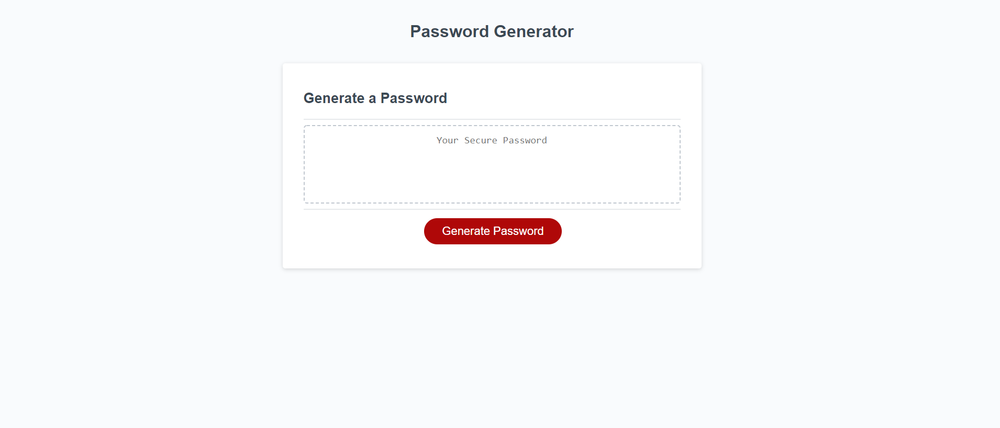

## Live Deploy
https://vygoth.github.io/Password-Generator/

# Password Generator

# Contact
Vygoth
JeremyJoanet@Protonmail.com

## Description
This application is a password generator! Upon initialization it prompts the user for password length, and then a series of conditionals that determine the composition of the password( lower/uppercase, symbols, numbers). After these prompts, it provides the user with a randomized password containing the selected elements at the desired length.

## Table of Contents
- [Usage](#Usage)
- [Credits](#Credits)
- [Screenshot](#Screenshot)

## Usage
This application features a live deploy link found at the top of this README.

## Credits
Tom Simion

## Screenshot

